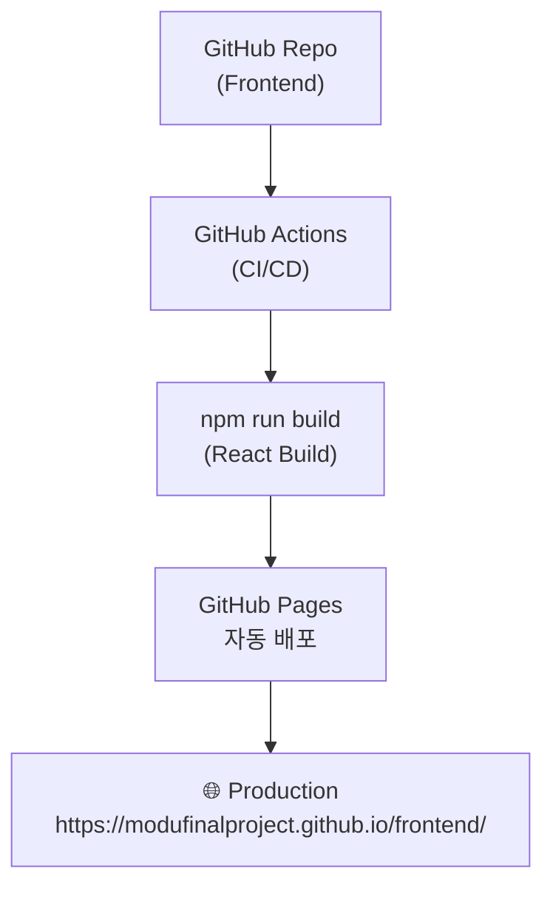

**목차**

1. 프로젝트 목적
2. 팀 구성 및 역할
3. 계획
4. 기술스택
5. 아키텍처 및 배포
6. 사이트맵
7. 프로세스 흐름
8. 시연
9. 트러블슈팅
10. 프로젝트 한줄평

### **1. 목적**

- 채용공고별로 이력서 및 자소서를 수정해야 하는 문제를 해결하기 위한 **개인 맞춤형 학습 및 준비 지원 플랫폼**을 구축한다.
- AI를 활용해 개인에게 최적화된 취업 준비 환경을 제공하는 서비스 개발

  1. 개인 맞춤형 학습 및 준비 지원,

     지원자가 목표하는 기업이나 직무에 따라 필요한 스터디 자료나 면접 대비 자료를 AI가 자동으로 생성해줌으로써, 효율적인 취업 준비를 가능하게 한다.,

  2. 이력서·자기소개서 첨삭 및 최적화 기능,

     AI 분석 기반으로 지원 기업의 채용공고와 기존 이력서를 비교하여 핵심 키워드, 경험 요소, 문항별 요구사항을 자동으로 파악하고, 이를 반영한 이력서·자기소개서 첨삭 기능을 제공한다.
     이를 통해 지원자는 기업별 맞춤 전략에 따라 문서 품질을 향상시키고, 보다 높은 완성도로 취업 경쟁력을 확보할 수 있다.

### 2. 팀 구성 및 역할

**팀명**: F5

**프로젝트명**: GAECHWI (개취): AI 기반 개인 맞춤형 취업 준비 지원 플랫폼

**프론트**: 임영후, 허지은, 윤여훈

**백엔드**: **김경환(팀장)** , 박영서

### 3. 계획

- 최초 계획
  - 회원관리
    - 일반 회원가입/로그인
    - 소셜 회원가입/로그인
    - 관리자 기능
      - 관리자 대시보드
      - 회원관리
      - 회원활동로그 조회
  - 기업공고
    - 기업공고관리
  - 이력서첨삭
    - 이력서 관리
    - 이력서 첨삭
      - 기본 첨삭
      - 기업공고별 이력서 첨삭
  - 모의면접
    - 모의면접진행
    - 모의면접평가
  - 스터디가이드
    - 트랜드 스터디가이드 생성
    - 기업공고별 스터디가이드 생성
- 축소 계획
  - 회원관리
    - 소셜 회원가입/로그인
  - 기업공고
    - 기업공고관리
  - 이력서첨삭
    - 이력서 관리
    - 이력서 첨삭
      - 기본 첨삭
      - 기업공고별 이력서 첨삭

### 4. 기술 스택

- 프론트엔드
  - React, TypeScript, Vanilla-Extract, Tanstack Query , Tanstack Form
- 백엔드
  - FastAPI, Uvicorn, PostgreSQL, SQLAlchemy, Alembic, Langchain, OpenAI, Redis, Python-jose(jwt),Oauth(google_auth), Boto3(Lightsail Bucket), Pydantic, Docker, Dockercompose, Postman

### 5. 아키텍처 및 배포

### **전체 구조**


프론트엔드 배포 자동화



### 6. 사이트맵, IA

- 사이트맵

```
GAECHWI
├── 비로그인 영역
│ ├── Landing (/landing)
│ ├── Login (/login)
│ ├── GoogleCallback (/googleCallback)
│ ├── SocialSignUp (/SocialSignUp)
│ └── NotFound (*)
│
├── 로그인 후 영역
│ ├── Dashboard (/dashboard)
│ ├── Resume Management
│ │ ├── Resume List (/resume)
│ │ ├── Resume Create (/resume/new)
│ │ ├── Resume Detail (/resume/:id)
│ │ ├── Resume Edit (/resume/:id/edit)
│ │ └── Resume Correction (/resume/:id/correction)
│ ├── Job Posting Management
│ │ ├── Job List (/jobs)
│ │ ├── Job Create (/jobs/new)
│ │ ├── Job Detail (/jobs/:id)
│ │ └── Job Edit (/jobs/:id/edit)
│ ├── Resume Feedback
│ │ ├── Feedback List (/resumeFeedback)
│ │ ├── Feedback Create (/resumeFeedback/new)
│ │ └── Feedback Detail (/resumeFeedback/:id)
│ └──Profile (/profile)
│
└── 공통 컴포넌트
├── Header, Topbar, Footer
├── Loading Overlay, Toast, Modals
└── Form / UI Components
```


- IA

| 영역                                                           | 페이지 / 라우트                                  | 목적                           | 주요 기능                                                                                                         | 연동 API (엔드포인트 / 메서드 / 인증)                                         |
| -------------------------------------------------------------- | ------------------------------------------------ | ------------------------------ | ----------------------------------------------------------------------------------------------------------------- | ----------------------------------------------------------------------------- |
| **비로그인 영역**                                              | Landing `/landing`                               | 서비스 소개·유입               | 서비스 가치 제안, 주요 기능 하이라이트, CTA(로그인/회원가입)                                                      | —                                                                             |
|                                                                | Login `/login`                                   | 인증 진입                      | Google OAuth 버튼                                                                                                 |                                                                               |
|                                                                | GoogleCallback `/googleCallback`                 | OAuth 콜백 처리                | 구글 토큰 처리, 세션/토큰 저장, 리디렉션, 탈퇴 회원복구 요청                                                      | `/auth/google` POST (비인증)                                                  |
| `/auth/activate` POST (회원복구/비인증)                        |
|                                                                | SocialSignUp `/SocialSignUp`                     | 보완정보 입력 후 회원가입 처리 | 소셜 회원 프로필 보완(추가 필드 입력)                                                                             | `/auth/signup` POST (비인증)                                                  |
|                                                                | NotFound `*`                                     | 404 처리                       | 오류 안내, 홈 복귀 버튼                                                                                           | —                                                                             |
| **로그인 후 영역 (Job Seeker)**                                | Dashboard `/dashboard`                           | 인증 후 메인(요약)             | 환영문구, 통계 카드(저장 이력서 수/AI 첨삭 횟수/저장 공고 수), 최근 이력서, 최근 활동                             | `/dashboard` GET (인증)                                                       |
| **이력서 관리**                                                | Resume List `/resume`                            | 이력서 목록 관리               | 리스트(페이지네이션/무한스크롤), 검색/필터, 정렬, 타입(일반/공고맞춤)                                             | `/resumes/?page=X&page_size=Y` GET (인증)                                     |
| `/resume_feedbacks/stantard/{resume_id}` POST (첨삭요청/인증), |
|                                                                | Resume Create `/resume/new`                      | 이력서 작성                    | 12개 섹션 폼(기본정보, 프로필사진, 자기소개, 학력, 경력, 프로젝트, 활동, 기술스택, 자격증 등), 파일/이미지 업로드 | `/resumes` POST (인증)                                                        |
|                                                                | Resume Detail `/resume/:id`                      | 이력서 읽기 전용               | 전체 섹션 표시, 옵션(수정/삭제/첨삭)                                                                              | `/resumes/{resume_id}` GET (인증)                                             |
|                                                                | Resume Edit `/resume/:id/edit`                   | 이력서 수정                    | 기존 데이터 자동 로드, 저장                                                                                       | `/resumes/{resume_id}` PUT (인증)                                             |
|                                                                | Resume Delete (옵션)                             | 이력서 삭제                    | 확인 다이얼로그 후 삭제                                                                                           | `/resumes/{resume_id}` DELETE (인증)                                          |
|                                                                | Resume Correction `/resume/:id/correction`       | AI 첨삭 결과 조회              | 원문 + 카테고리별 피드백                                                                                          | `/resume_feedbacks/content/{feedback_id}` GET (결과/인증)                     |
| **채용공고 관리**                                              | Job List `/jobs`                                 | 공고 목록 조회                 | 무한 스크롤, 검색·필터(회사명/키워드), 정렬(최신순)                                                               | `/jobs/?page=X&page_size=Y` GET (인증)                                        |
|                                                                | Job Create `/jobs/new`                           | 공고 저장                      | 공고명, 회사명, URL, 마감일, 필수요건, 우대사항, 메모                                                             | `/jobs` POST (인증)                                                           |
|                                                                | Job Detail `/jobs/:id`                           | 공고 상세 조회                 | 공고 전체 정보, 저장/공유 기능                                                                                    | `/jobs/{job_id}` GET (인증)                                                   |
|                                                                | Job Edit `/jobs/:id/edit`                        | 공고 수정                      | 기존 데이터 자동 로드, 저장                                                                                       | `/jobs/{job_id}` PUT (인증)                                                   |
|                                                                | Job Delete                                       | 공고 삭제                      | 확인 다이얼로그 후 삭제                                                                                           | `/jobs/{job_id}` DELETE (인증)                                                |
| **AI 첨삭(Feedback)**                                          | Feedback List `/resumeFeedback`                  | 첨삭 이력 관리                 | 첨삭 목록, 매칭율(High/Medium/Low) 아이콘, 항목 수 표시                                                           | `/resume_feedbacks/?page=X&page_size=6` GET (인증)                            |
|                                                                | Feedback Create `/resumeFeedback/new`            | 첨삭 요청                      | 채용공고 선택(모달), 이력서 선택(드롭다운), 요청 제출                                                             | `/resume_feedbacks/posting/${formData.resumeId}/${formData.jobId}`POST (인증) |
|                                                                | Feedback Detail `/resumeFeedback/:id`            | 첨삭 상세 조회                 | 원문, 매칭율(%), 카테고리별 피드백                                                                                | `/resume_feedbacks/content/{feedback_id}` GET (인증)                          |
|                                                                | Feedback Delete                                  | 첨삭 삭제                      | 확인 다이얼로그 후 삭제                                                                                           | `/resume_feedbacks/{feedback_id}` DELETE (인증)                               |
| **프로필 / 계정**                                              | Profile `/profile`                               | 계정 정보 관리                 | 이름, 이메일(읽기전용), 전화, 주소 수정, 계정 생성일/마지막 로그인, 계정 삭제                                     | `/users/me` GET/PUT/DELETE (인증)                                             |
| **공통 컴포넌트 / UX**                                         | Header / Topbar / Footer                         | 네비게이션                     | 로고, 사용자 메뉴(프로필/로그아웃), 주요 네비게이션 링크                                                          | —                                                                             |
|                                                                | Loading Overlay / Toast / Modal / Confirm Dialog | 전역 상태 표현                 | API 호출 전역 로딩, 성공/오류 토스트, 모달(채용공고 선택 등)                                                      | —                                                                             |
| **추가(기술·운영)**                                            | 반응형                                           | UX 적응                        | Desktop/Tablet/Mobile 레이아웃 분기(사이드바, 2열 → 1열) 등                                                       | —                                                                             |
|                                                                | 권한/인증                                        | 보안                           | JWT/세션 기반 인증(로그인/인증 필요 엔드포인트 표시)                                                              | 로그인 관련 엔드포인트(비인증) 외 대부분 인증 적용                            |

### 7. 프로세스 흐름

- 회원관리
  - 소셜 회원가입/로그인
    

  - 마이페이지
    

- 공고관리
  - 기업 채용공고 작성/수정/삭제
    

- 이력서관리
  - 이력서 작성/수정/삭제
    

  - 이력서 기본 첨삭
    

- 공고별 첨삭 관리
  - 기업 채용공고를 통한 자신의 이력서 첨삭
    


### 8. 시연

### 9. 트러블 슈팅

**프론트**

1. 서버 에러 발생 시 해결까지 많은 시간이 걸림

   **문제: API 에러가 발생했는데 원인을 모르겠음**

   증상

   ```
   프론트엔드에서 에러 메시지 표시
   하지만 구체적인 원인이 명확하지 않음
   백엔드 개발자에게 보고해도 원인 파악에 시간이 오래 걸림
   ```

   해결책: Putty로 직접 서버 로그 확인

- **1-1. Putty & Puttygen 설치**
  Putty 설치
  ```
  1. 공식 사이트: <https://www.putty.org/>
  2. Windows의 경우 putty.exe 다운로드
  3. 실행
  ```
  Puttygen 설치 (PEM → PPK 변환용)
  ```
  1. Putty 사이트에서 puttygen.exe 다운로드
  2. puttygen.exe 실행
  3. Conversions → Import key 메뉴 클릭
  4. 백엔드 개발자에게 받은 PEM 파일 선택
  5. Save private key 버튼 클릭
  6. PPK 파일로 저장 (예: gaechwi_server.ppk)
  ```
- **1-2. Putty로 서버 접속**

  - PPK 파일로 접속 (보안성 높음)\*\*

  ```
  1. Putty 실행
  2. Category → Connection → SSH → Auth 클릭
  3. "Private key file for authentication"
     → Browse 버튼 클릭
  4. 변환한 PPK 파일 선택
  5. Category → Session으로 돌아가기
  6. Host Name: {API 서버 ip주소} 입력
  7. Open 버튼 클릭

  login as: [사용자명]
  (비밀번호 입력 안 해도 됨)

  8. 접속 완료

  user@server:~$ ← 이 프롬프트가 보이면 성공
  ```

- **1-3. 서버 로그 확인**

  ```bash
  # 백엔드 개발자에게 받은 경로로 이동
  cd gaechwi_project

  # 로그 출력
  docker-compose logs -f backend

  # Ctrl + C 로 종료
  ```

- **1-4. 실제 사용 사례**

  ```bash
  # 사례 : 첨삭 이력서 생성 실패

  # 1. 로그 확인
  backend  | 2025-11-18 08:26:41,031 - sqlalchemy.engine.Engine - INFO - [cached since 1667s ago] ('degree', '3')
  backend  | 2025-11-18 08:26:41,031 INFO sqlalchemy.engine.Engine [cached since 1667s ago] ('degree', '3')
  backend  | 2025-11-18 08:26:48,711 - httpx - INFO - HTTP Request: POST <https://api.openai.com/v1/chat/completions> "HTTP/1.1 200 OK"
  backend  | 2025-11-18 08:26:48,718 - sqlalchemy.engine.Engine - INFO - INSERT INTO resumefeedbacks (resume_id, user_id, posting_id, parent_content, matching_rate, created_at) VALUES ($1::INTEGER, $2::INTEGER, $3::INTEGER, $4::VARCHAR, $5::INTEGER, $6::TIMESTAMP WITH TIME ZONE) RETURNING resumefeedbacks.feedback_id
  backend  | 2025-11-18 08:26:48,719 - sqlalchemy.engine.Engine - INFO - [cached since 1426s ago] (68, 3, None, '# 이력서 내용 요약\\n\\n## 개인 정보\\n- **이름**: 윤여훈  \\n- **이메일**: dbsdugns16@gmail.com  \\n- **성별**: 남성  \\n- **주소**: 서울시 강남구  \\n- **전화번호**: 010-1111-1111  \\n- **군  ... (965 characters truncated) ... *: 2025년 1월 1일 ~ 2025년 2월 1일\\n\\n## 기술 스택\\n- React  \\n- Linux  \\n- Node.js  \\n- MySQL\\n\\n## 자격증\\n- **자격증**: 없음\\n\\n## 포트폴리오\\n- **포트폴리오 URL**: 없음\\n\\n---', 0, datetime.datetime(2025, 11, 18, 8, 26, 48, 718802, tzinfo=datetime.timezone.utc))
  backend  | 2025-11-18 08:26:48,718 INFO sqlalchemy.engine.Engine INSERT INTO resumefeedbacks (resume_id, user_id, posting_id, parent_content, matching_rate, created_at) VALUES ($1::INTEGER, $2::INTEGER, $3::INTEGER, $4::VARCHAR, $5::INTEGER, $6::TIMESTAMP WITH TIME ZONE) RETURNING resumefeedbacks.feedback_id
  backend  | 2025-11-18 08:26:48,719 INFO sqlalchemy.engine.Engine [cached since 1426s ago] (68, 3, None, '# 이력서 내용 요약\\n\\n## 개인 정보\\n- **이름**: 윤여훈  \\n- **이메일**: dbsdugns16@gmail.com  \\n- **성별**: 남성  \\n- **주소**: 서울시 강남구  \\n- **전화번호**: 010-1111-1111  \\n- **군  ... (965 characters truncated) ... *: 2025년 1월 1일 ~ 2025년 2월 1일\\n\\n## 기술 스택\\n- React  \\n- Linux  \\n- Node.js  \\n- MySQL\\n\\n## 자격증\\n- **자격증**: 없음\\n\\n## 포트폴리오\\n- **포트폴리오 URL**: 없음\\n\\n---', 0, datetime.datetime(2025, 11, 18, 8, 26, 48, 718802, tzinfo=datetime.timezone.utc))
  backend  | 2025-11-18 08:26:48,720 - sqlalchemy.engine.Engine - INFO - ROLLBACK
  backend  | 2025-11-18 08:26:48,720 INFO sqlalchemy.engine.Engine ROLLBACK
  backend  | 2025-11-18 08:26:48,722 - app.routers.resume_feedback - ERROR - error: (sqlalchemy.dialects.postgresql.asyncpg.IntegrityError) <class 'asyncpg.exceptions.NotNullViolationError'>: null value in column "posting_id" of relation "resumefeedbacks" violates not-null constraint
  backend  | DETAIL:  Failing row contains (53, 68, 3, null, # 이력서 내용 요약

  # 에러 로그 확인:
  backend  | 2025-11-18 08:26:48,722 - app.routers.resume_feedback - ERROR - error: (sqlalchemy.dialects.postgresql.asyncpg.IntegrityError) <class 'asyncpg.exceptions.NotNullViolationError'>: null value in column "posting_id" of relation "resumefeedbacks" violates not-null constraint

  # 백엔드에 보고
  # resumefeedbacks 테이블에서 posting_id 컬럼이 not null인데, 실제로는 값이 없어 데이터 생성에 실패합니다.
  # 해당 컬럼을 null 허용하거나, -1 등의 임의 값을 추가하여 해결해야 될 것으로 보입니다.
  # 로그 전체를 첨부했습니다.
  ```

- **1-5. 배운 점**
  효율적인 협업:
  1. 오류 발생 시 로그를 먼저 보고 오류 원인을 파악한 후, 로그와 함께 전달.
  2. 백엔드 개발자가 로그를 보고 즉시 원인 파악 및 수정
     비효율적인 협업:
     "API가 안 작동합니다"
     (원인 파악에 여러 번 메시지 왕복 필요)
     효과:
     → 서버 에러 해결 속도 매우 단축
     → 백엔드 개발자의 디버깅 시간 단축
     → 재현 불가능한 버그도 로그로 분석 가능
     결론 : 서버 로그를 직접 확인하여 에러 원인을 백엔드 개발자가 파악하기 쉽게 해주면 협업 효율이 극적으로 향상됩니다!

1. Tanstack Form와 zod를 이용한 복잡한 폼 구현

   - 이력서의 데이터 생성/수정 페이지를 문자열, 객체, 배열 등의 복잡한 구조의 UI와 폼데이터 구조를 작성해야 했습니다.
   - 작성해야 하는 구조에 따라 컴포넌트를 만들고 데이터를 순회하여 중복 코드를 최소화 하기 위해 노력했습니다.
   - 폼 상태 관리는 Tanstack Form, 스키마 및 유효성 검사는 zod을 적용해 구현했습니다.

1. 디자인시스템 만들기
   - 프로젝트 초기부터 **디자인 토큰 기반의 시스템을** 구축하였습니다. 그 결과, **반복적인 UI 개발 시간을 단축**시키고 개발 과정에서 발생하는 오류를 최소화하여 팀의 전반적인 **생산성을 크게 향상**시켰습니다.

**백**

1. N+1 Query Problem - contains_eager를 통한 성능 개선

**문제: 이력서 상세 조회 시 쿼리가 기하급수적으로 증가**

이력서 상세 조회 시 experiences, educations, projects, activities, technology_stacks, qualifications 등 6개의 관련 테이블 데이터를 함께 반환하면서 쿼리가 기하급수적으로 증가했습니다.

```
각 이력서마다 관련 테이블 6개를 개별 쿼리로 조회: 1 + N × 6 형태

```

ORM 관계 데이터를 명시적으로 로드하지 않으면, 각 Resume 객체에 접근할 때마다 관련 데이터를 별도 쿼리로 조회하는 N+1 문제가 발생합니다.

해결책: SQLAlchemy의 contains_eager를 활용하여 OUTER JOIN 결과에서 직접 관계 데이터를 로드했습니다.

```python
from sqlalchemy.orm import contains_eager

stmt = (
    select(Resume, ...)
    .outerjoin(Resume.experiences)
    .outerjoin(Resume.educations)
    .outerjoin(Resume.projects)
    .outerjoin(Resume.activities)
    .outerjoin(Resume.technology_stacks)
    .outerjoin(Resume.qualifications)
    .options(
        contains_eager(Resume.experiences),
        contains_eager(Resume.educations),
        contains_eager(Resume.projects),
        contains_eager(Resume.activities),
        contains_eager(Resume.technology_stacks),
        contains_eager(Resume.qualifications),
    )
    .where(Resume.resume_id == resume_id)
)

result = await db.execute(stmt)
row = result.unique().first()

```

배운 점:

- `outerjoin`: 관계를 JOIN으로 명시적으로 연결
- `contains_eager`: JOIN 결과에서 직접 관계 데이터 로드
- `result.unique()`: JOIN으로 인한 중복 행 제거
- contains_eager는 명시적 JOIN이 필요함
- 여러 관계를 한 번에 로드하면 JOIN 결과에 직접 반영

효과:
→ 불필요한 쿼리 제거로 데이터 조회 성능 대폭 향상
→ 데이터베이스 부하 감소
→ 사용자 경험 개선

1. AI 응답 데이터 구조 불일치 - LangChain 파싱 실패

**문제: OpenAI API 응답이 Pydantic 스키마와 맞지 않아 필드 누락이나 타입 오류 발생**

이력서 피드백 생성 시 LangChain으로 LLM 응답을 파싱할 때 feedback_contents 필드 누락, matching_rate의 타입 오류(string 반환) 등으로 ValidationError 발생. 프롬프트에 JSON 형식 지시가 부족하면 LLM이 자유로운 형식으로 응답.

원인: 프롬프트에 JSON 구조가 명확하게 명시되지 않아 LLM이 형식을 자유롭게 해석. LangChain의 구조화된 출력 기능(structured_output) 미사용으로 LLM이 응답 형식 강제 없음.

해결책: Pydantic 스키마의 Field에 description 추가 후, LangChain의 `with_structured_output()`을 사용. description과 제약(ge, le, min_items)이 프롬프트에 자동 포함되어 LLM이 정확한 형식 생성.

```python
class ResumeFeedbackAI(BaseModel):
    matching_rate: int = Field(ge=0, le=100, description="매칭률")
    feedback_contents: List[dict] = Field(min_items=1, description="피드백 리스트")

chain = prompt | llm.with_structured_output(ResumeFeedbackAI)
result = await chain.ainvoke({"resume": data})

```

배운 점:

- `with_structured_output()`은 Pydantic 스키마 기반 자동 JSON 검증 수행
- Field의 description이 LLM이 실제로 따르는 지시사항
- ge, le, min_items 같은 제약 조건이 프롬프트에 자동 반영
- 구조화된 출력 없으면 LLM이 형식을 예측 불가능하게 변경 가능

효과:
→ AI 응답 구조의 일관성 보장 (매번 동일한 형식)
→ ValidationError 제거로 안정적인 파이프라인
→ 프롬프트 엔지니어링과 타입 안전성의 결합

1.

---

### 10. 프로젝트 한줄평

김경환 : 첫번째 프로젝트때는 혼자해서 힘들고 아무것도 몰랐는데... 이번 프로젝트는 다같이 진행해서 팀원분들이 정말 많이 알려주시고 해서, 이것저것 배웠던게 매우 많아서 힘이 되어주고, 좋은 팀 프로젝트 경험이었던거 같습니다!

박영서 : 생각보다 할게 너무 많고 공부할것도 많았습니다.

임영후 : 다들 고생하셨습니다.

허지은 : **우당탕탕 f5**, 짧은 기간 동안 생각보다 많은 일이 있었고.. 여태 공부한 것 보다 앞으로 공부할 것이 훨씬 더 많은 거 같습니다.

윤여훈 : 사용자 친화적 UI/UX 만드는게 많이 어렵네요. 자유주제라 디자인부터 기능정의까지 정말 쉽지 않았을텐데 다른 개발자분들 정말 고생 많이 하셨습니다.
